# Part II: JavaScript - Adding Interactive features

## Terminologies

### Programming language
A **programming language** is a formal language, which comprises a set of instructions that produce various kinds of output. ([Wikipedia](https://en.wikipedia.org/wiki/Programming_language))

### JavaScript
**JavaScript**, often abbreviated as **JS**, is a programming language that conforms to the ECMAScript specification. ([Wikipedia](https://en.wikipedia.org/wiki/JavaScript))

### ECMAScript
**ECMAScript** (or **ES**) is a scripting-language specification standardized by Ecma International. ([Wikipedia](https://en.wikipedia.org/wiki/ECMAScript))

## Getting ready for JavaScript

### JavaScript Console

In Google Chrome, go to View > Developer > Developer Tools, then go to the *Console* panel.

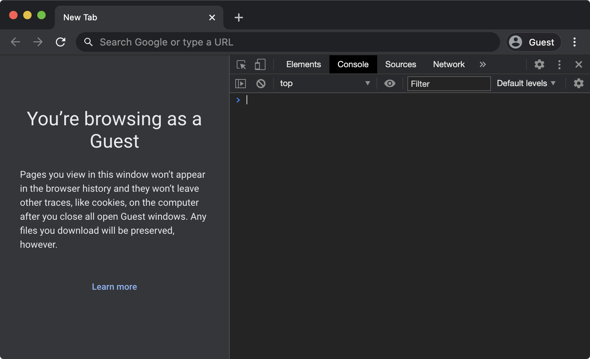

Console is where JavaScript code can output information with `console.log();`. It is a place where developers can monitor what is going on in the code. We can even enter JavaScript code here directly to see real-time results, but **code entered here is only temporary and will not be saved**.

### Adding JavaScript to HTML

Similar to CSS, there are two ways to add JavaScript to HTML.

#### Internal 
```html
<!DOCTYPE html>
<html>
  <body>
    // put your HTML code here
    <script>
      // put your JavaScript code here
    </script>
  </body>
</html>
```

#### External

```html
<script src="path/to/javascript.js"></script>
```

## Introduction to Programming

### Variables

In JavaScript, we use `let` to declare a variable and `const` to declare a variable that will not be reassigned.

```javascript
let views = 0;
const USERNAME = 'jack';
```

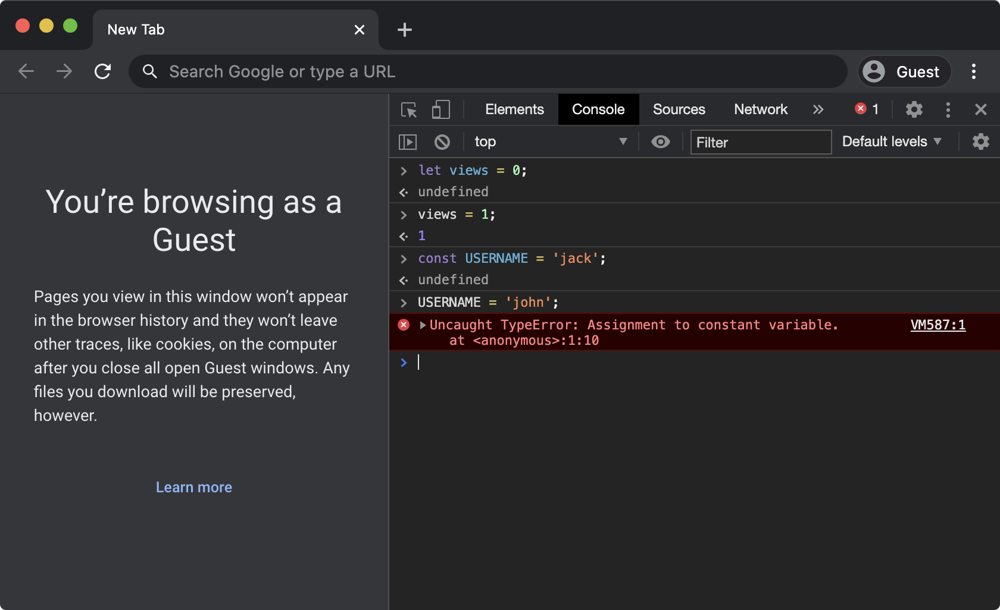

In the above example, `views` and `USERNAME` are the __names__ of the variables, and `0` and `'jack'` are the __values__ of the variables.

- JavaScript let: [https://www.w3schools.com/js/js_let.asp](https://www.w3schools.com/js/js_let.asp)
- JavaScript const: [https://www.w3schools.com/js/js_const.asp](https://www.w3schools.com/js/js_const.asp)

#### Data types

In JavaScript, a variable can hold a number, string, and Boolean, etc.

```javascript
let age = 20;
let name = "John Doe";
let isStudent = true;
```

- JavaScript data types: [https://www.w3schools.com/js/js_datatypes.asp](https://www.w3schools.com/js/js_datatypes.asp)
- JavaScript data types and data structures: [https://developer.mozilla.org/en-US/docs/Web/JavaScript/Data_structures](https://developer.mozilla.org/en-US/docs/Web/JavaScript/Data_structures)

### Operators

#### Arithmetic operators

One of the most basic operations you can do in JavaScript is arithmetic operations, namely, addition (`+`), substraction (`-`), multiplication (`*`), and division (`/`), etc.

```javascript
let a = 10;
let b = 5;
let c = a + b; // the value of 15 (the sum of a and b) is assigned to the variable c
```

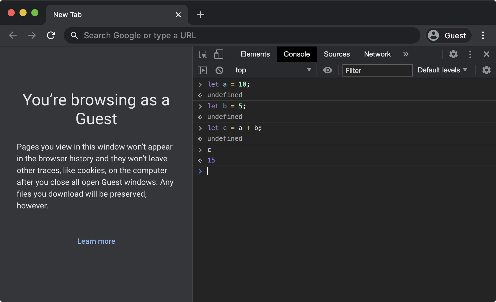

#### Assignment operators

We have been using the simple assignment operator (`=`) since the beginning of this workshop, which assigns the value of its right operand to its left operand. But there are more.

```javascript
let x += y; // same as let x = x + y;
let x -= y; // same as let x = x - y;
let x *= y; // same as let x = x * y;
let x /= y; // same as let x = x / y;
```

#### String operators

We can use the concatenation operation (`+`) to concatenate two string values.

```javascript
let firstName = 'John';
let lastName = 'Doe';
let fullName = firstName + ' ' + lastName; // the string value 'John Doe' is assigned to fullName
```

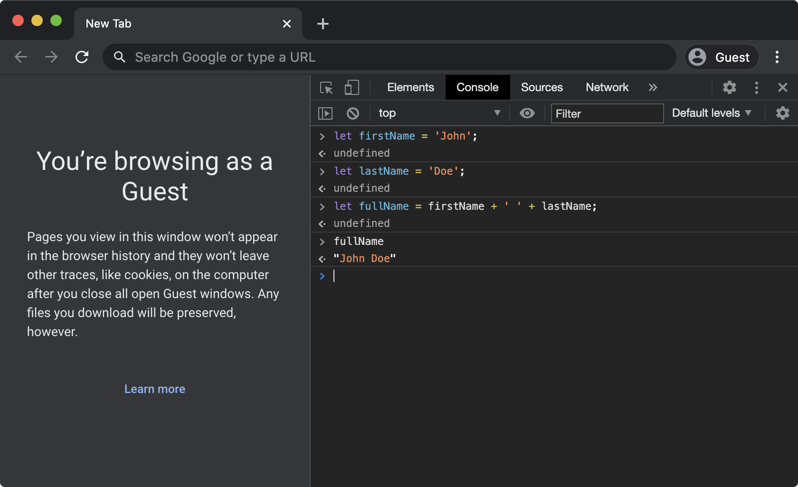

#### Comparision operators

We can use comparision operators to compare two values and it returns a Boolean value based on whether or not the comparsion if true.

```javascript
let a = 2;
let b = 3;
let c1 = (a == b)  // Boolean value false is assigned to c1
let c2 = (a != b)  // Boolean value true is assigned to c2
let c3 = (a > b)   // Boolean value false is assigned to c3
let c4 = (a < b)   // Boolean value true is assigned to c4
```

#### Logical operators

Logical operators are used with Boolean values. There are logical AND (`&&`), logical OR (`||`), and logical NOT (`!`).

```javascript
let a1 = true && true;          // Boolean value true is assigned to a1
let a2 = true && false;         // Boolean value false is assigned to a2
let b1 = true || false;         // Boolean value true is assigned to b1
let b2 = false || false;        // Boolean value false is assigned to b2
let c1 = !true;                 // Boolean value false is assigned to c1
let c2 = !false;                // Boolean value true is assigned to c2
let d1 = (3 > 2) || !(2 == 2);  // Boolean value true is assigned to d1
let d2 = (3 > 2) && !(2 == 2);  // Boolean value false is assigned to d2
```

There are many more types of operators. You can check them out in the links below.

- JavaScript operators: [https://www.w3schools.com/js/js_operators.asp](https://www.w3schools.com/js/js_operators.asp)
- JavaScript expressions and operators: [https://developer.mozilla.org/en-US/docs/Web/JavaScript/Guide/Expressions_and_Operators](https://developer.mozilla.org/en-US/docs/Web/JavaScript/Guide/Expressions_and_Operators)

### Conditionals

One really important feature of programming languages is to carry out different sets of instructions when different conditions are met. We use `if`, `else if`, and `else` for this.

```javascript
let a = 5;
let b = 2;
if (a < b) {                          // conditions are put in parentheses
  console.log('a is less than b');    // this line is run only if the condition `a < b` evaluates to true
} else if (a == b) {                  // this is evaluated only if the previous condition evaluates to false
  console.log('a equals to b');       // this line is run only if the condition `a == b` evaluates to true and the previous condition evaluates to false
} else {                              // no conditions should be provided for `else`
  console.log('a is greater than b'); // this line is run only if all previous conditions evaluate to false
}
```

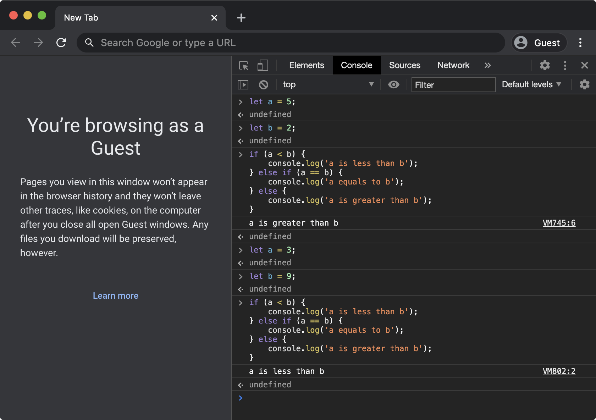

In the above example, all three statements (`if`, `else if`, and `else`) are used, but that is not always the case. We can use any combinations of them with a few rules:

1. `if` is always required and must be the first statement when there is more than one statements
2. `else` must be the last statement if being used
3. `else if` can be used for as many times in between `if` and `else`

- JavaScript if else and else if: [https://www.w3schools.com/js/js_if_else.asp](https://www.w3schools.com/js/js_if_else.asp)
- Making decisions in your code — conditionals: [https://developer.mozilla.org/en-US/docs/Learn/JavaScript/Building_blocks/conditionals](https://developer.mozilla.org/en-US/docs/Learn/JavaScript/Building_blocks/conditionals)
- Learn JavaScript - Conditionals: [https://www.codecademy.com/learn/introduction-to-javascript/modules/learn-javascript-control-flow/cheatsheet](https://www.codecademy.com/learn/introduction-to-javascript/modules/learn-javascript-control-flow/cheatsheet)

### Loops

One other great thing programming languages can do is to carry out the same instructions for as many times as we want (almsot). This is done with loops. Two of the most common types of loops are `for` and `while`.

#### for

The `for` statement loops through a block of code for a specified number of times.

```javascript
for (let i = 0; i < 10; i++) {  // before the for loop starts, i is set to be 0
  console.log(i);               // this line is run while i < 10 evaluates to true, otherwise this for loop is finished
}                               // i++ is the same as i = i + 1, so i is incremented by 1 before i < 10 is evaluated again
```

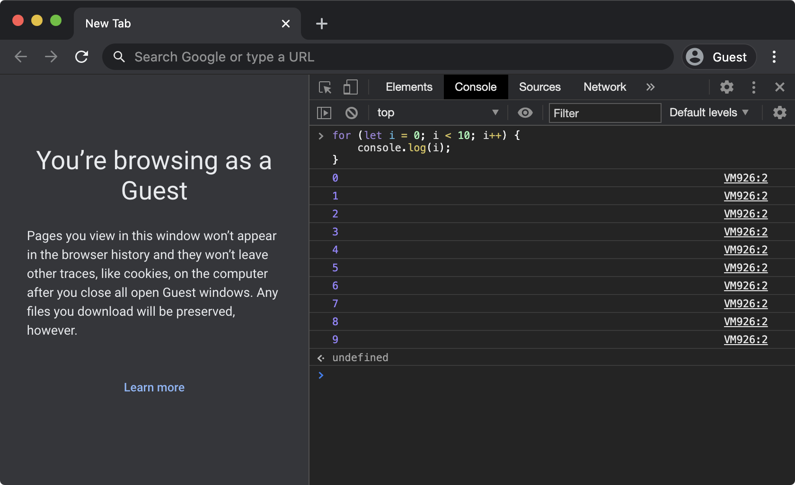

#### while

The `while` statement loops through a block of code while a specified condition evaluates to `true`.

```javascript
let i = 0;        // sets i to 1
while (i < 10) {  // loops the code block below only if i < 10 evaluates to true
  console.log(i);
  i++;            // increments i by 1
}
```

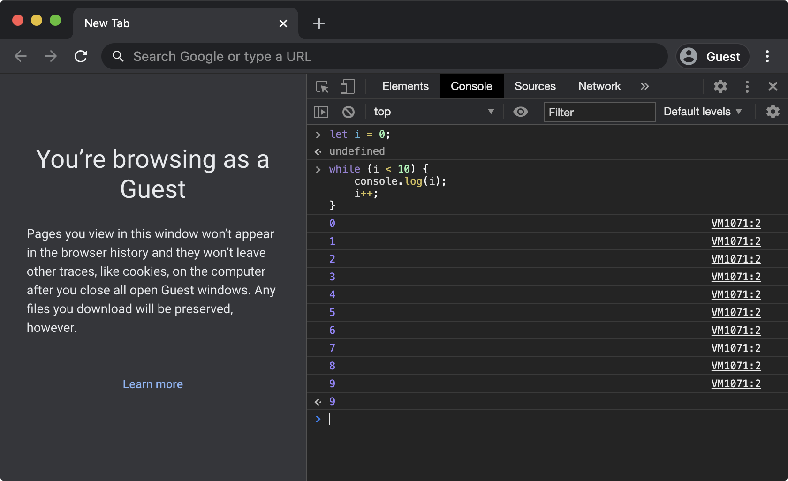

The above `while` example is equivalent to the previous `for` example, but since they are structured differently, they can be used to fit different needs.

- JavaScript for statement: [https://www.w3schools.com/jsref/jsref_for.asp](https://www.w3schools.com/jsref/jsref_for.asp)
- JavaScript for loop: [https://www.w3schools.com/js/js_loop_for.asp](https://www.w3schools.com/js/js_loop_for.asp)
- Loops and iteration: [https://developer.mozilla.org/en-US/docs/Web/JavaScript/Guide/Loops_and_iteration](https://developer.mozilla.org/en-US/docs/Web/JavaScript/Guide/Loops_and_iteration)

### Arrays

An array is a special data type that lets you store multiple values in a single variable. We access the individual values by specifying their indices in `[]`, starting from `[0]` for the first value, `[1]` for the second value, and so on.

```javascript
let fruits = ['apple', 'peach', 'strawberry']; // creates an array containing three different fruit names
console.log(fruits[1]);                        // logs the value with index 1 ('peach')
console.log(fruits[2]);                        // logs the value with index 2 ('strawberry')
fruits[0] = 'blueberry';                       // modifies the value with index 0 ('apple') to be 'blueberry'
console.log(fruits[0]);                        // logs the value with index 0 ('blueberry')
```

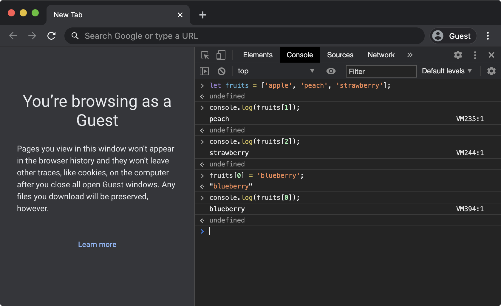

- JavaScript arrays: [https://www.etihad.com/en-ae/](https://www.etihad.com/en-ae/)
- Array: [https://developer.mozilla.org/en-US/docs/Web/JavaScript/Reference/Global_Objects/Array](https://developer.mozilla.org/en-US/docs/Web/JavaScript/Reference/Global_Objects/Array)

## Manipulating HTML & CSS with JavaScript

### Document Object Model (DOM)

When a web page is loaded, the browser creates a Document Object Model. It allows JavaScript to control many aspects of the web page, including both HTML and its CSS styles. In order to access the HTML document object defined by DOM, we use the keyword `document`.

Here are a few examples:

```javascript
console.log(document);                                // logs the entire DOM document object
console.log(document.body);                           // logs the body of the document
console.log(document.getElementsByTagName('h2'));     // logs an array of all <h2> elements in the document
console.log(document.getElementsByClassName('html')); // logs an array of all elements with class html in the document
```

_The web page used in the following examples can be found [here](https://jackbdu.github.io/web-dev-workshop/01-html-and-css/14-a-simple-styled-website/index.html) and the source code of the web page can be found [here](https://github.com/jackbdu/web-dev-workshop/blob/master/01-html-and-css/14-a-simple-styled-website/)._

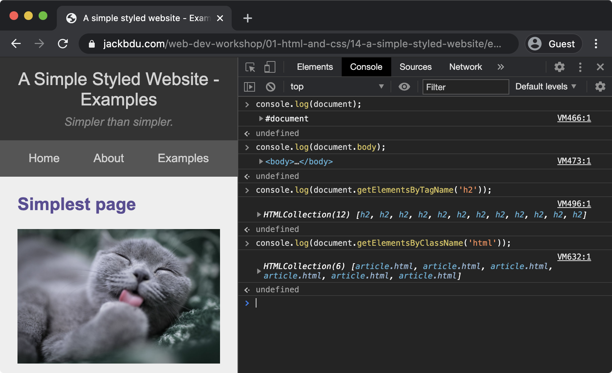

In addition, we can use `document.getElementById()` to access a specific HTML element by specifying its `id`.

- JavaScript HTML DOM: [https://www.w3schools.com/js/js_htmldom.asp](https://www.w3schools.com/js/js_htmldom.asp)
- Document Object Model (DOM): [https://developer.mozilla.org/en-US/docs/Web/API/Document_Object_Model](https://developer.mozilla.org/en-US/docs/Web/API/Document_Object_Model)
- JavaScript HTML DOM Document: [https://www.w3schools.com/js/js_htmldom_document.asp](https://www.w3schools.com/js/js_htmldom_document.asp)

### innerHTML

We've learned how to access different HTML elements in JavaScript, in order to modify the HTML content within the element, we use `innerHTML`. Note that `document.getElementsByTagName()` and `document.getElementsByClassName()` return an array of elements, so we need to specify the index of the exact element to be modified.

```javascript
document.getElementsByTagName('h1')[0].innerHTML = 'Replaced Website Title';   // replaces the HTML content of the first <h1> element found
document.getElementsByTagName('p')[0].innerHTML = 'Replaced Website Tagline';  // replaces the HTML content of the first <p> element found
document.getElementsByTagName('h2')[0].innerHTML = 'Replaced Website Tagline'; // replaces the HTML content of the first <h2> element found
for (let i = 0; i < document.getElementsByTagName('a').length; i++) {          // iterates through all the <a> elements
  document.getElementsByTagName('a')[i].innerHTML = 'Link ' + i;               // replaces the HTML content of the <a> element with index i
}
```

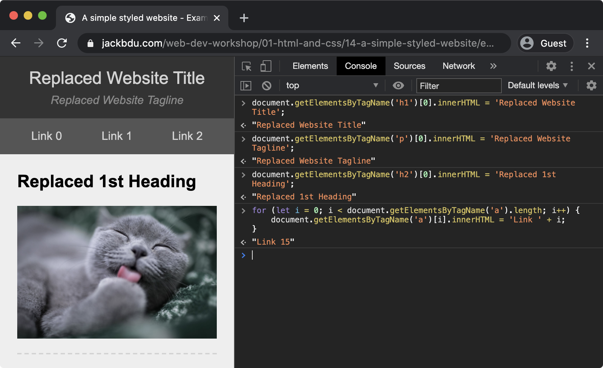

- HTML DOM innerHTML property: [https://www.w3schools.com/jsref/prop_html_innerhtml.asp](https://www.w3schools.com/jsref/prop_html_innerhtml.asp)

### Style

Similarly, we can use `style` to edit the CSS style of the element. Note that `-` is not allowed in JavaScript syntax, so we need to convert CSS property names into cameCase.

```javascript
document.body.style.backgroundColor = 'red';                                 // sets background-color of body to be 'red'
document.getElementsByTagName('a')[1].style.color = 'green';                 // sets color of the second <a> element found to be 'green'
document.getElementsByClassName('html')[0].style.border = '5px dashed blue'; // sets the border of the first element with class 'html' to be be '5px dashed blue'
```

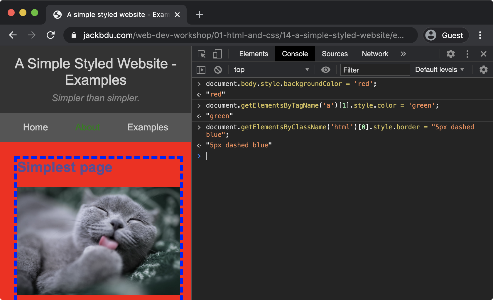

- JavaScript HTML DOM - Changing CSS: [https://www.w3schools.com/js/js_htmldom_css.asp](https://www.w3schools.com/js/js_htmldom_css.asp)
- Camel case: [https://en.wikipedia.org/wiki/Camel_case](https://en.wikipedia.org/wiki/Camel_case)

## Other resources

- JavaScript style guide and coding conventions: [https://www.w3schools.com/js/js_conventions.asp](https://www.w3schools.com/js/js_conventions.asp)
- Airbnb JavaScript Style Guide: [https://github.com/airbnb/javascript](https://github.com/airbnb/javascript)

## Suggested homework

- Make a simple game with all that you have learned
- It does not need to be a conventional video game, be creative!
- Note down your questions and bring them to the next workshop
- Of course, also bring your game to the next workshop so we can all have some fun together
